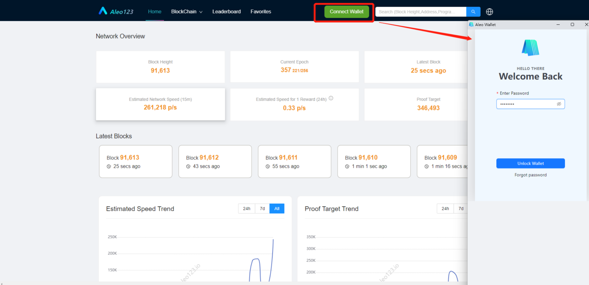
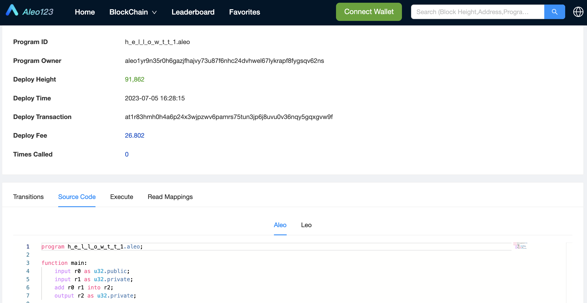
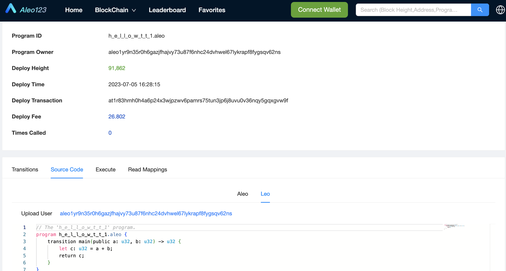
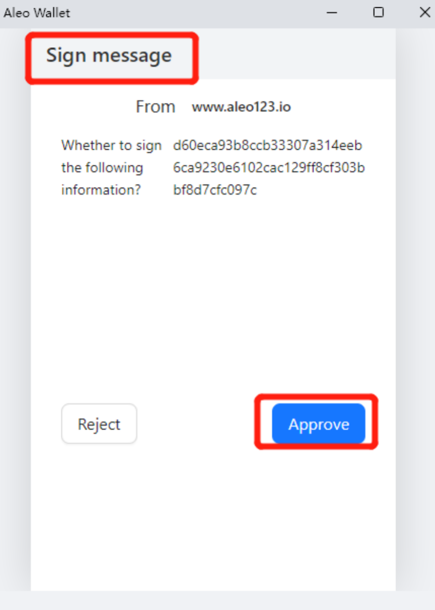
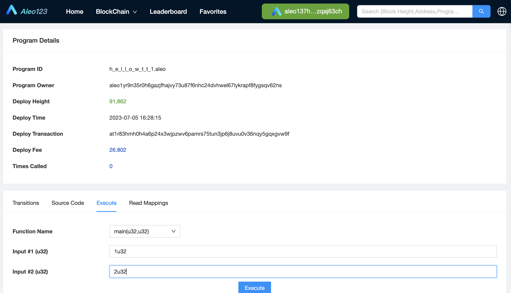
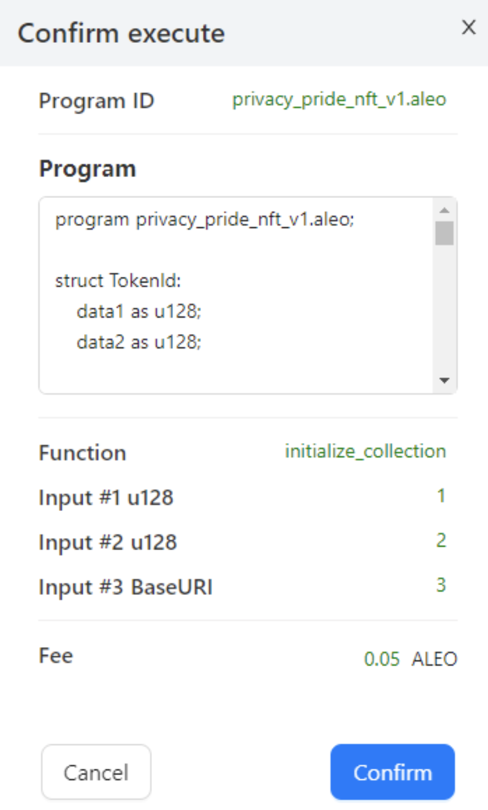
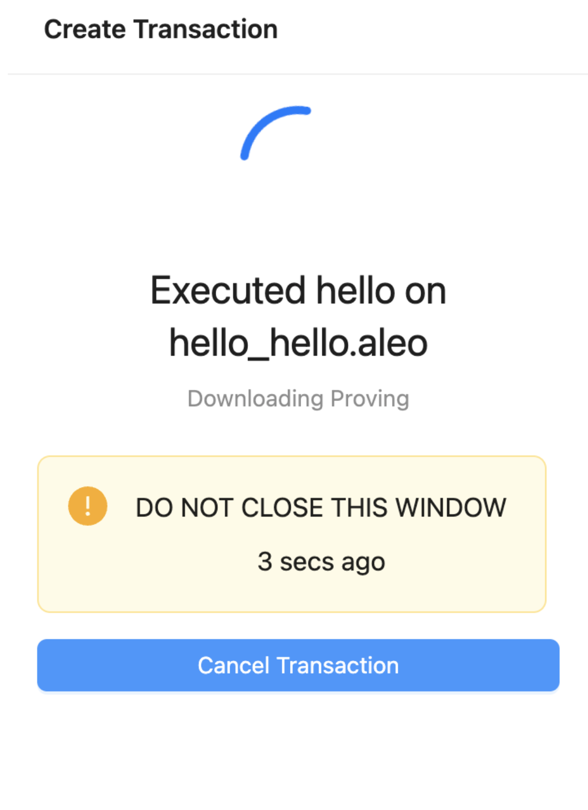
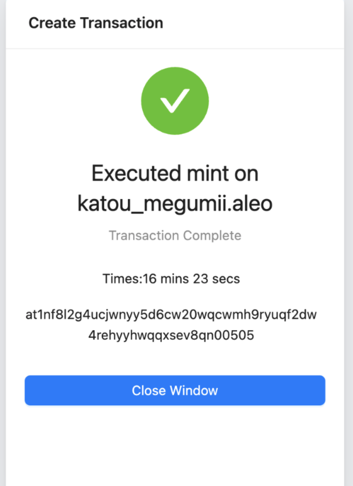
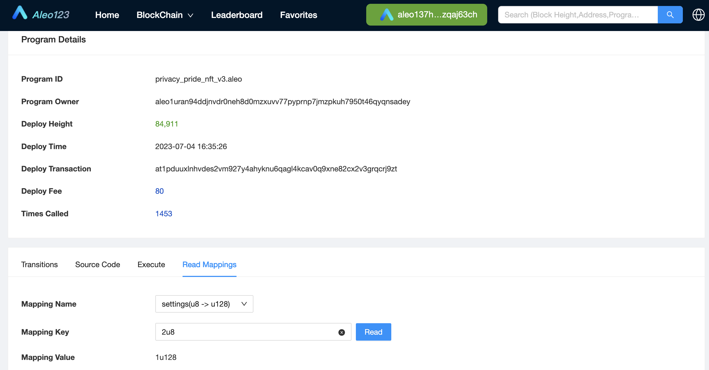

# 新功能

## 连接钱包

- 下载 [Soter | Aleo Walle](aleo123.com)
- 点击 "Connect Wallet"，自动拉起钱包，输入账户密码后可连接至钱包
  
  
- 提供“Copy Address”和“Disconnect”

## Program Details

- 新增**Program Owner**，Program的部署者
- 新增Tab**Source Code**
  - Aleo code, 代码通过`https://vm.aleo.org/api/testnet3/program/{programID}`获取；对关键字进行高亮展示，便于阅读
    
  - Leo code， 用户展示由“Program Owner”上传的源代码（代码的正确性由Program Owner来保证）
    
    - 上传要求: 必须由Program Owner来进行上传；过程中由Program Owner进行一次签名，签名不产生费用。
    

        
    

    - 当连接的钱包地址与Program Owner一致时，显示可编辑
- 新增Tab**Execute**
  - `Function Name` 展示当前Program的所有Function。
  - `Input #X` 根据选中的Function的入参数个数一次显示输入框
  - 用户正确输入Input参数（暂未做参数合法性校验）
    

        
    

  - 点击“Confirm”，开始执行，等待成功
    

        
    

- 新增Tab**Read Mappings**
  - `Mapping Name` 展示当前Program的所有Mapping，`key type` 和`value type`,选中mapping
  - `Mapping Key` 输入正确的key值，点击 **Read** 按钮，查询结果
    